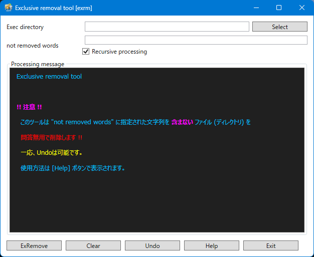

  

	
	

|項目|内容|
|:--|:--|
|Exec directory [ ]|処理対象ディレクトリ|
|not removed word [ ]|削除対象外文字列|
|☑ Recursive processing|ディレクトリ階層再帰処理|
|Processing message|処理内容表示ウィンドウ|
|[ExRemove]|削除実行|
|[Clear]|削除対象外文字列初期化|
|[Undo]|変換取り消し(初期状態に戻ります)|
|[Help]|Help表示|
|[Exit]|ツール終了|

  
