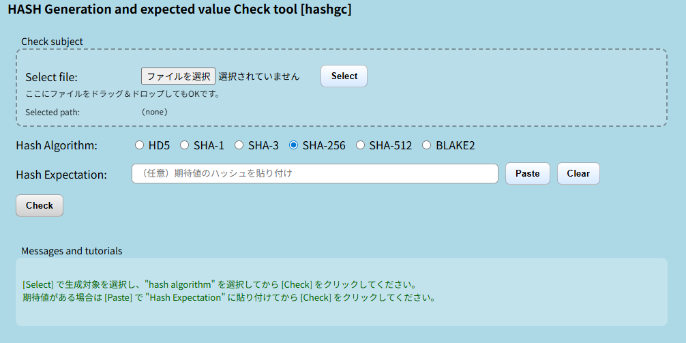

<p align="left">
  
  
</p>

# Hash value generation and comparison tool [hashgc]



<br>

## Overview
ファイルの整合性確認（チェックサム検証）を手作業で行う際の手間とミスを削減するために開発したツールです。  

複数のハッシュアルゴリズムに対応し、生成結果と期待値の比較をワンステップで実行可能です。  
業務における検証作業の効率化およびヒューマンエラー防止を目的としています。

<br>

## Features

- ファイルからハッシュ値を生成
- 期待値との比較（Match / Discrepancy 表示）
- 複数アルゴリズム対応  
  - MD5 / SHA-1 / SHA-256 / SHA-512 / BLAKE2
- クリップボードから期待値を貼り付け（Paste）
- シンプルなUIによる直感的操作
- エラーハンドリング（未選択・不正入力）
- メッセージ表示による操作ガイド

<br>

## API (FastAPI)

本ツールは FastAPI によりAPI化されています。

<br>

### Endpoints

- `POST /hash`
  - ファイルをアップロードしてハッシュ値を生成

- `POST /compare`
  - 生成したハッシュと期待値を比較

<br>

## Usage

1. 「Select」で対象ファイルを選択  
    又はドラッグ&ドロップにてアップロード
2. ハッシュアルゴリズムを選択  
3. 期待値を貼り付け(任意) 
4. 「Check」をクリック  

<br>

## Use Case

- ダウンロードファイルの整合性確認
- 配布物の改ざん検知(内容保障)

<br>

## Tech Stack

- Python 3.x
- FastAPI
- Jinja2
- python-multipart
- Visual Studio

<br>

## Documentation  

Doxygen により生成できます。
→ ソースコードの可読性向上と構造理解を目的としています。
```bash  
doxygen Doxyfile
```

<br>

## 📄 License

TBD
