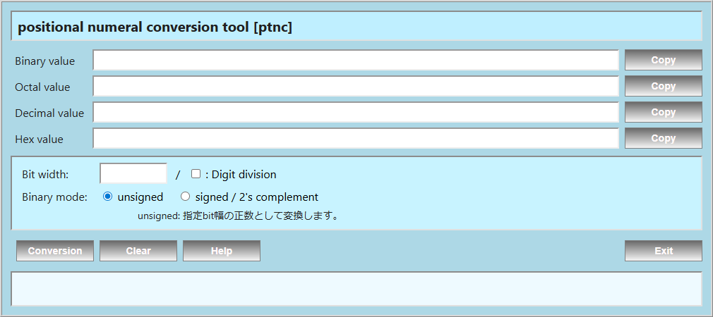

<p align="left">
  
  
</p>

#  positional numeral conversion tool [ptnc]


<br>

## Overview
2進数、8進数、10進数、16進数の相互変換を行うツールです。

2進数10桁(Excel上限)を超える数値を扱う事が出来ます。  
単位区切り(SI接頭語)","を挿入する事が出来ます。

また、FLASK により Webアプリとすることで、リモート利用可能としています。  
将来的な自動化処理やクラウド環境での利用も視野に入れた構成としています。

<br>

## Features
- 位取り記数法間の相互変換
- 負数(2進数では2の補数表現)に対応
- 桁区切り","を挿入可能
- 2進数の出力桁数を指定可能
- シンプルなUIによる直感的操作
- エラーハンドリング（未選択・不正入力）
- メッセージ表示による操作ガイド

<br>

## Frame work (FLASK)
本ツールは FLASK により Webアプリとして作成されています。
### Endpoints
- `POST /comvert`
  - 変換数値を各位取り記法(2進数、8進数、10進数、16進数)へ変換

<br>

## Usage
1. "Binary","Octal","Decimal","Hex"のいずれかの"value"欄に数値を入力
2. ｢Conversion｣をクリック
3. 各"value"に表示された数値を｢Copy｣

<br>

## Use Case
- 数値を各位取り記法の数値へ変換
　(2進数はExcel上限以上の桁に対応)
- 桁区切り(",")の付加

<br>

## Tech Stack
- Python 3.x
- FLASK

<br>

## Requirements
- Python 3.10 以上
- pip

<br>

## Install

```bash
pip install -r requirements.txt
```

<br>

## Run (Local)

```bash
uvicorn app:app --host 0.0.0.0 --port 8000 --reload
```

<br>

## Access
* Application  
    http://127.0.0.1:5000

* Swagger UI  
http://localhost:8000/docs

<br>

## Run with Docker
Docker を使用して実行することもできます。  

<br>

## Build

```bash
docker build -t hashgc .
```

<br>

## Run

```bash
docker run -p 8000:8000 hashgc
```

## Access
* Application  
  http://localhost:8000  

* Swagger UI  
  http://localhost:8000/docs

<br>

## Deployment Perspective
本ツールは単体のローカルGUI用途に留まらず、FastAPI による API 化により、以下のような運用を想定しています。  
* ローカル環境での検証ツール
* 社内向けAPIとしての利用
* Docker コンテナによる実行環境の統一
* クラウド環境への展開

<br>

## Documentation
Doxygen により生成できます。
ソースコードの可読性向上と構造理解を目的としています。  

```bash
doxygen Doxyfile
```
生成後、以下のファイルをブラウザで開くことでドキュメントを確認できます。  
```
docs/html/index.html
```

<br>

## License
TBD