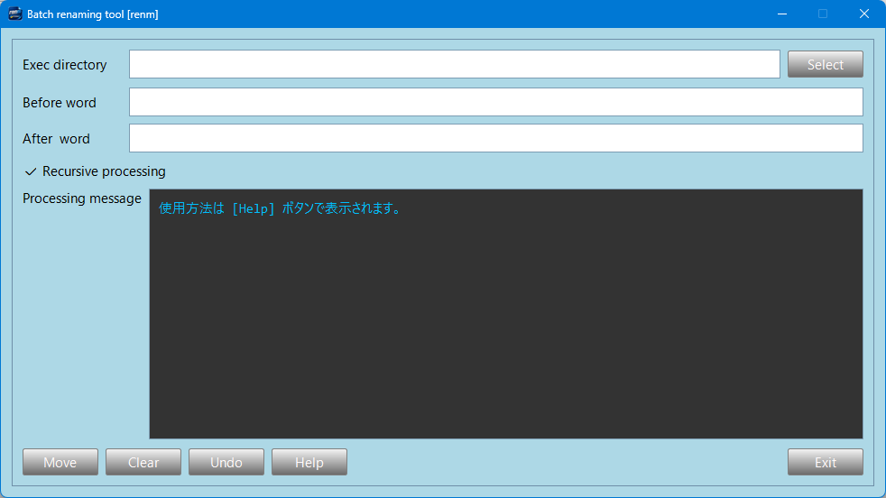

<p align="left">
  
  
</p>

<p align="center">
  
</p>

---

# renm_ps6 - Batch Renaming Tool

**Fast, safe, and flexible batch renaming tool with regex support.**

ファイル / ディレクトリ名の一括変換を安全かつ効率的に行うためのデスクトップGUIツールです。

---

## ✨ Features

* ファイル / ディレクトリの一括リネーム
* 正規表現対応（柔軟なパターン変換）
* サブディレクトリを含めた再帰処理
* 処理内容のリアルタイム表示
* Undoによる安全な復元
* シンプルで直感的なGUI（PySide6）
* 単体exeで実行可能（Windows）

---

## 🚀 Usage

1. **Exec directory** を選択
2. **Before word** に変換前文字列（正規表現可）を入力
3. **After word** に変換後文字列を入力
4. **Move** をクリックして実行
5. 必要に応じて **Undo** で元に戻す

---

## ⚠️ Caution

本ツールはファイル / ディレクトリ構成を変更します。
誤操作により意図しない結果になる可能性があります。

そのため、以下の対策を実装しています：

* 処理内容の可視化（ログ表示）
* バックアップ生成（.bk）
* Undoによる復元機能

---

## 🖥️ UI Components

| 項目                     | 説明             |
| :--------------------- | :------------- |
| Exec directory         | 処理対象ディレクトリ     |
| Before word            | 変換前文字列（正規表現対応） |
| After word             | 変換後文字列         |
| ☑ Recursive processing | サブディレクトリを再帰処理  |
| Processing message     | 処理ログ表示         |
| Move                   | 変換実行           |
| Clear                  | 入力クリア          |
| Undo                   | 変更の取り消し        |
| Help                   | ヘルプ表示          |
| Exit                   | 終了             |

---

## 🛠️ Tech Stack

* Python 3.x
* PySide6

---

## 📦 Build (for developers)

```bash
pyinstaller ^
  --noconsole ^
  --onefile ^
  --icon=renm_ps6.ico ^
  --add-data "renm_ps6.ico;." ^
  --collect-all PySide6 ^
  renm_ps6.py
```

---

## 🎯 Purpose

* 手作業によるリネーム作業の効率化
* 操作ミスの削減
* 大量ファイル処理の自動化

---

## 📄 License

TBD

---
