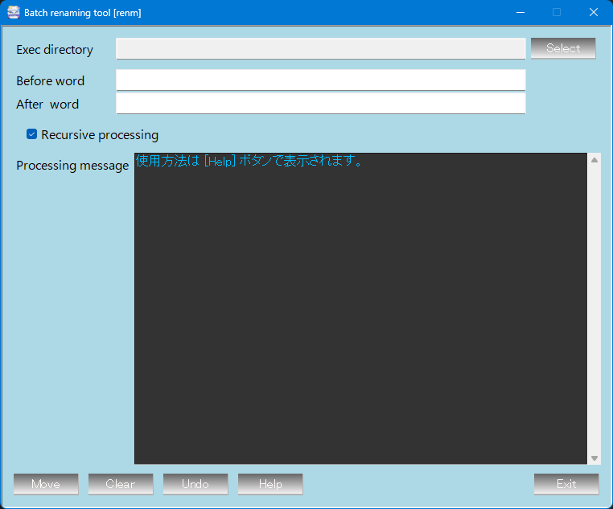

	
	

 

|項目|内容|
|:--|:--|
|Exec diGrectory [ ]|処理対象ディレクトリ|
|Before word [ ]|変換前文字列|
|After  word [ ]|変換後文字列|
|☑ Recursive processing|ディレクトリ階層再帰処理|
|Result message|処理内容表示ウィンドウ|
|[Move]|変換実行|
|[Clear]|変換前後文字列初期化|
|[Undo]|変換取り消し(初期状態に戻ります)|
|[Help]|Help表示|
|[Exit]|ツール終了|
